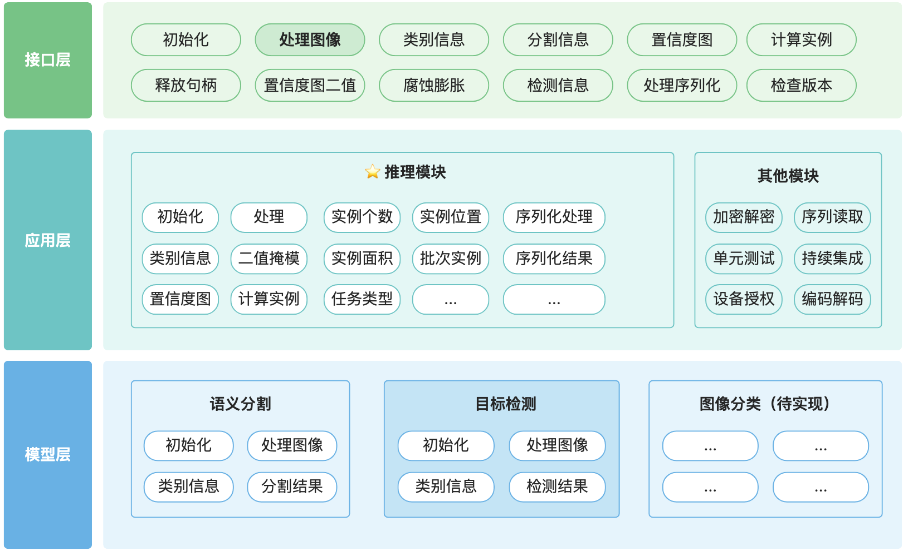
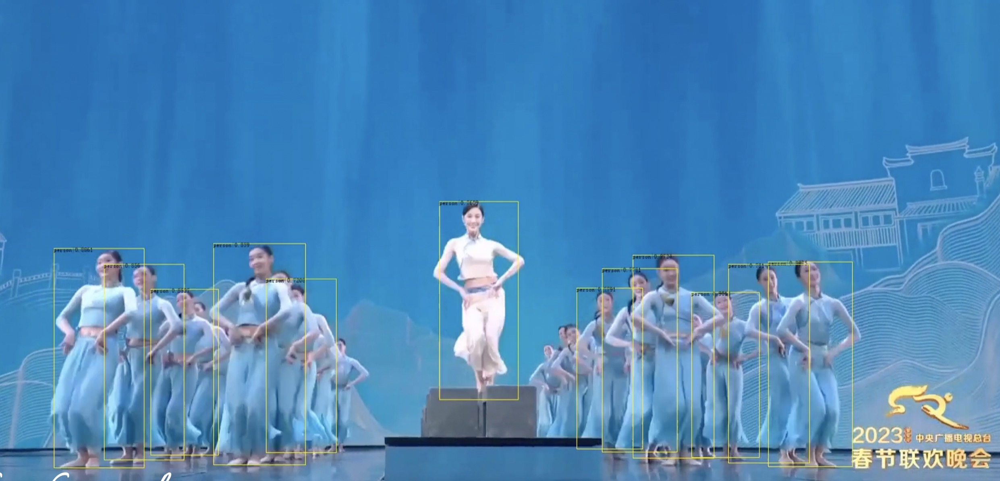
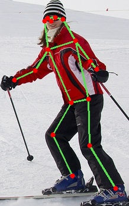
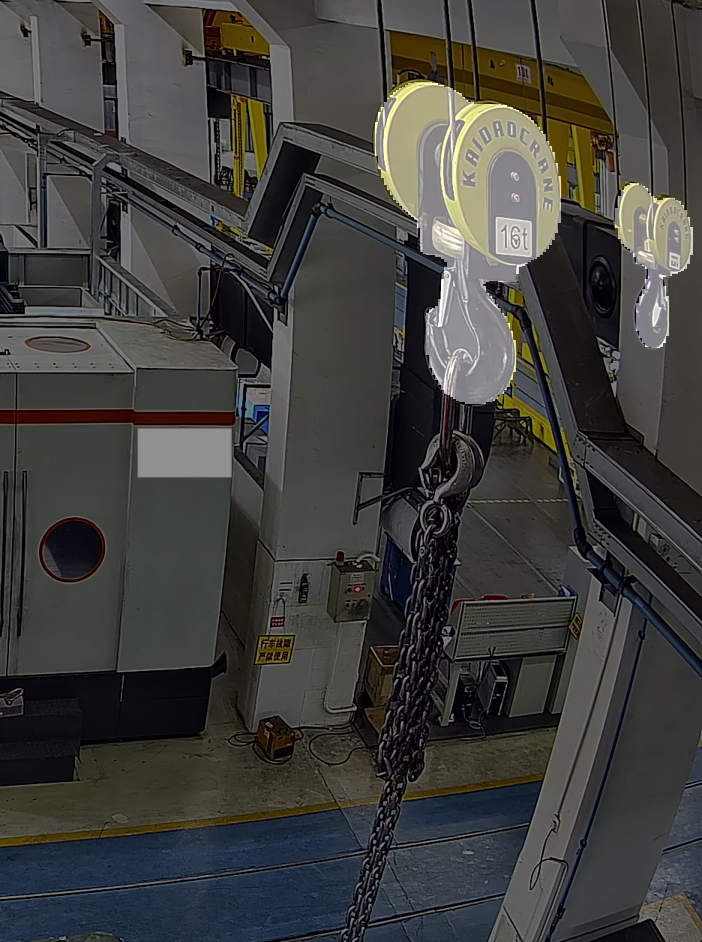
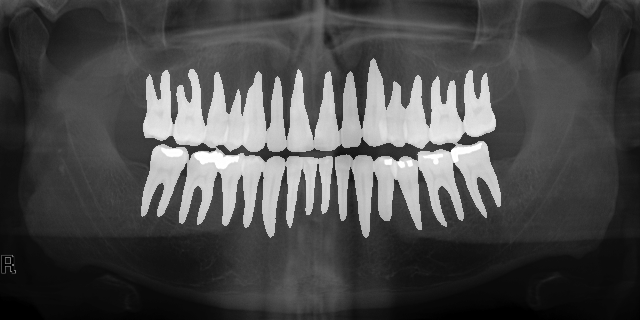
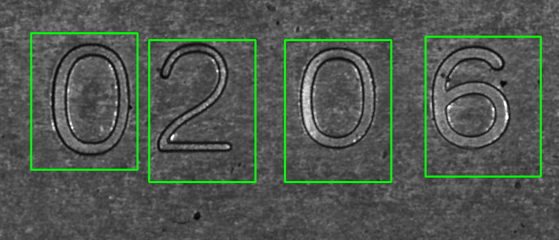
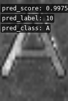

# AisDeployC-Demo

## Deploy Demo Code for Artificial Intelligence System（人工智能系统推理库Demo）

### Introduction and Description（介绍和说明）

<p align="center">
 
</p>

- 本算法库发布Windows Linux 和 MacOs三个平台的库文件，目前支持C++和Python调用接口，具体接口文档在本页最下方链接中。本算法库会持续发布本算法库匹配的高精度算法模型和使用示例，算法库可以在本页ModelZoo中查找，使用示例在源文件的example当中。

- This algorithm library is released on Windows, Linux, and MacOs platforms, and currently supports C++ and Python calling interfaces. The specific interface documents can be found at the bottom link of this page. This algorithm library will continue to release high-precision algorithm models and usage examples matched with this algorithm library, which can be found in the ModelZoo section of this page. The usage examples can be found in the "example" folder of the source files### Trial and Authorization（试用和授权）

- 如果您想试用本算法库，请直接下载并进行试用。本算法库仅支持有限次数的调用，如果您超过了试用次数，将会自动保存未经授权的文件。如果您希望继续使用本算法库，请将文件和说明发送到我的电子邮箱。Email:  hit.zhou.j.h@gmail.com

- If you want to try this algorithm library, please download and try it directly. This algorithm library only supports limited number of calls. If you exceed the trial limit, unauthorized files will be automatically saved. If you want to continue using it, please send the files and instructions to my email.EMAIL: hit.zhou.j.h@gmail.com

- 请使用generate_license接口生成未授权license文件.

- Please use  interface generate_license to generate unregisted license file. 

### FAQ

[FAQ.pdf](docs/FAQ.pdf)

### Usage（使用方式)

#### 1. Environments installation（环境安装）

| Items           | Recommended version<br/>（推荐版本）     | Resources<br/>（资源）                                                                                                                                                                                                                                                                                                                  |
| --------------- | ---------------------------------- | ----------------------------------------------------------------------------------------------------------------------------------------------------------------------------------------------------------------------------------------------------------------------------------------------------------------------------------- |
| System<br/>（系统） | Windows 10<br/>Windows Server 2019 |                                                                                                                                                                                                                                                                                                                                     |
|                 | Ubuntu 18.04<br/>Docker            |                                                                                                                                                                                                                                                                                                                                     |
|                 | MacOS                              |                                                                                                                                                                                                                                                                                                                                     |
| IDE-Windows     | VS2017                             | 目前我们是使用VS2017编译的库，建议使用相同的版本                                                                                                                                                                                                                                                                                                         |
| CUDA            | 11.3                               | **No installation is required if you use a cpu.**<br/>**如果您使用cpu则不需要安装**.<br/>cuda_11.3.0_465.89_win10.exe: https://pan.baidu.com/s/18AvyfSq-dUl7egc0CsGYKQ?pwd=j9q2 提取码: j9q2<br/>cuda_11.3.0_465.19.01_linux.run：链接: https://pan.baidu.com/s/1cdMCnZ1FoNv9eVrun39kLQ?pwd=mh6s 提取码: mh6s                                           |
| cudnn           | 8.8                                | **No installation is required if you use a cpu.**<br/>**如果您使用cpu则不需要安装**.<br/>cudnn-linux-x86_64-8.8.0.121_cuda11-archive.tar.xz：链接: https://pan.baidu.com/s/1S_4VYj63R3zCSJyGDQwsmg?pwd=bgvl 提取码: bgvl<br/>cudnn-windows-x86_64-8.8.1.3_cuda11-archive.zip: 链接: https://pan.baidu.com/s/11P64Ks8IDfxmvhAjPaCusg?pwd=3tdl 提取码: 3tdl |

##### Cuda & Cudnn Install（Cuda Cudnn 安装）

Windows:

- Step1（步骤1）：Use cuda_11.3.0_465.89_win10.exe  to install, make sure to check if your Environment variables have the path to CUDA as belows. (使用cuda_11.3.0_465.89_win10.exe安装，确保您的环境变量设置如下)
  
  - CUDA_PATH  — -> C:\Program Files\NVIDIA GPU Computing Toolkit\CUDA\v11.0
  
  - CUDA_PATH_V11_03 — → C:\Program Files\NVIDIA GPU Computing Toolkit\CUDA\v11.0

- Step2（步骤2）：Extract cudnn-windows-x86_64-8.8.1.3_cuda11-archive.zip（解压 udnn-windows-x86_64-8.8.1.3_cuda11-archive.zip）
  
  - Copy the contents of the cuDNN folder to the path where we installed CUDA in Step1. We need the contents of the **bin**, **include** & **lib** folders from cuDNN to be inside the **bin**, **include** and **lib** folders of the CUDA directory （将cuDNN中内容拷贝到步骤1中CUDA位置中，需要将bin include 和 lib文件夹中文件从cuDNN中拷贝到cuda文件夹中相应位置中）

#### 2. Downloads(下载)

Please download the **latest library files** and **Demo source code** in Releases on the right side of the github homepage.

（请在github主页右侧的Releases中下载**最新库文件**和**Demo源代码**。）

- Library file naming method（库文件命名方式）：
  
  - linux：AisDeployC-linux-x64-gpu-version.zip
  
  - windows: AisDeployC-windows-x64-gpu-version.zip

- Demo source code（源文件）：Source code (zip)

- 解压源代码，以下称为代码**工程目录**,假设目录地址为 your_dir/aisdeployc_demo

- 解压库文件，解压到代码**工程目录**下，假设解压目录为 your_dir/aisdeployc_demo/build

#### 3. Start Running (开始运行)

3-a Python Users（Python 用户）

- Run example (运行示例)
  
  - Semantic Segmentation(语义分割)
    
    ```
    python example/run_sem.py\
     --lib_path  cmake-build-release/AisDeployC.dll
     --model tests/assets/models/epoch_200_segmentor_setting_oen.aism
     --image_path tests/assets/images/1.jpg
     --vis_dir tests/assets/images/vis
    ```
  
  - Object Detection(目标检测)
    
    处理图片
    
    ```
    python example/run_det.py\
     --lib_path  cmake-build-release/AisDeployC.dll
     --model tests/assets/models/sft_recog_compose.aism
     --image_path tests/assets/images/A.jpeg
     --vis_dir tests/assets/images/vis
    ```
    
    处理视频
    
    ```
    python example/run_det_video.py \
     --lib_path  cmake-build-release/AisDeployC.dll
     --model tests/assets/models/sft_recog_compose.aism
     --video_path xxx/xxx.mp4
     --vis_dir tests/assets/images/vis
     --license xxx/reisted_info.aisl
    ```
  
  - Pose Estimation(姿态估计)
    
    ```
    python example/run_pose.py\
     --lib_path  cmake-build-release/AisDeployC.dll
     --model E:\\LargeFiles\\human_pose_est_17p_r50.aism
     --image_path tests/assets/images/human-pose.jpg
     --vis_dir tests/assets/images/vis
    ```
  
  - Face Recognition(人脸识别)
    
    ```
    python example/run_face_recog.py\
     --lib_path  cmake-build-release/AisDeployC.dll
     --model E:\\LargeFiles\\face_embedding_r27_setting.aism
     --image_path tests/assets/images/Salma_Hayek_0001.jpg,tests/assets/images/Salma_Hayek_0002.jpg,tests/assets/images/Martina_McBride_0004.jpg
     --vis_dir tests/assets/images/vis
    ```
  
  - Segment Anything (分割所有)
    
    ```
    python example/run_gsem.py\ 
     --lib_path cmake-build-release/AisDeployC.dll
     --encoder_model E:\\LargeFiles\\sam_vit_b_01ec64_encoder-quant.aism
     --decoder_model E:\\LargeFiles\\sam_vit_b_01ec64_decoder-quant_merge.aism
     --vis_dir _vis
     --image_path tests/assets/images/0_Parade_marchingband_1_100.jpg
    ```

- Run pytest examples（运行pytest示例）
  
  ```
  python -m pytest -s tests/test_interface.py
  ```

- Optional single api （可选，形成单个api）
  
  **Server:**
  
  ```
  python example/api_server.py \
   --lib_path build/libAisDeployC.so \
   --port 9003 \
   --model tests/assets/models/det_setting_oen.aism \
   --license tests/assets/licenses/registed/linux_registed_info.aisl
  ```
  
  **Client**
  
  *--gateway_host （后面的路由名字取决于server的文件名，因为server路由中定义为@app.route("/image/<name>",methods=['POST'])）*
  
  ```
  python tests/test_api_server.py \
   --image_path tests/assets/images/0_Parade_marchingband_1_100.jpg \
   --gateway_host /image/api_server
  ```

- Optional multiple api （可选，形成多个api）
  
  **Server:**
  
  ```
  python example/api_server_dynamic.py \
   --lib_path build/libAisDeployC.so \
   --port 9003 \
   --config_path tests/assets/settings/api_server_dynamic.json\
   --license tests/assets/licenses/registed/linux_registed_info.aisl
  ```
  
  **Client**
  
  *--gateway_host （后面的路由名字取决于server的文件名，因为server路由中定义为@app.route("/image/",methods=['POST'])）*
  
  ```
  python tests/test_api_server.py \
   --image_path tests/assets/images/0_Parade_marchingband_1_100.jpg \
   --gateway_host /image/detection_face
  ```

##### 3-b C++ Visual Studio sln Users (C++ Visual Studio sln 解决方案用户)

- AisDeployC header （AisDeployC头文件）
  
  项⽬->项⽬属性->C/C+±>常规->附加包含⽬录，加入本工程路径，例如
  
  ```
  xxxx/Desktop/AisDeployC-Demo
  ```

- opencv2 header （opencv 头文件）
  
  项⽬->项⽬属性->C/C+±>常规->附加包含⽬录，加入opencv2⽂件夹的⽗⽬录，例如
  
  ```
  xxxx/Desktop/AisDeployC-Demo/thirdparty/opencv3/include
  ```

- add AisDeployC.lib （增加 AisDeployC.lib附加库目录）
  
  项⽬->项⽬属性-链接器-常规-附加库⽬录，加入AisDeployC.lib库所在的⽂件夹，例如
  
  ```
  xxxx/Desktop/AisDeployC-windows-gpu-vxxx
  ```

- add opencv libs（增加 opencv库目录）
  
  项⽬->项⽬属性-VC++⽬录-库⽬录，加入opencv各lib库所在的文件夹，例如
  
  ```
  xxxx/Desktop/AisDeployC-Demo/thirdparty/opencv3/lib/Windows
  ```

- link lib files (链接 lib 库文件)
  
  项⽬->项⽬属性-链接器-输入，加入附加依赖项
  
  ```
  AisDeployC.lib
  IlmImf.lib
  ippicvmt.lib
  ippiw.lib
  ittnotify.lib
  libjasper.lib
  libjpeg-turbo.lib
  libpng.lib
  libprotobuf.lib
  libtiff.lib
  libwebp.lib
  opencv_imgproc3416.lib
  opencv_imgcodecs3416.lib
  opencv_core3416.lib
  zlib.lib
  ```

- 选择编译器，x64 Release，编译，生成的工作路径一般在 x64/Release

- 若出现 值“MT_StaticRelease”不匹配值“MD_DynamicRelease”
  
  - 属性-c/c++-代码⽣成-运⾏库中，改成（release为MT，debug为MTD）

- 将库文件AisDeployC-windows-gpu-vxxx 中的lib拷贝到工作路径中

- 在工作路径中终端启动（方便显示print结果）：shift + 鼠标右键，选择PowerShell，执行 .\工程名.exe

- 可能会出现路径问题，请在example的代码中修改模型文件路径和输入图像路径

- 如果出现[ERROR] .aisl显示授权错误 unauthorize 或未激活，是因为.aisl过期或未激活，请将文件和说明发送到我的电子邮箱。Email: [hit.zhou.j.h@gmail.com](mailto:hit.zhou.j.h@gmail.com)

- 如果有其他问题，可以先看 [FAQ.md](docs/FAQ.md)

##### 3-c C++ CMAKE Users (C++ CMAKE用户)

- 修改CMakeLists.txt
  
  - 修改底层库ONNX地址，目前底层库打包在库文件文件夹中，所以这里选择解压后的库文件地址
    
    - 根据你的系统，修改set(ONNX_RUNTIME_PATH your_dir/aisdeployc_demo/build)
    
    - Linux修改[Linux修改处，第6行]([AisDeployC-Demo/CMakeLists.txt at master · JinghuiZhou/AisDeployC-Demo · GitHub](https://github.com/JinghuiZhou/AisDeployC-Demo/blob/master/CMakeLists.txt#L6))
    
    - Windows修改[Windows修改处，第14行](https://github.com/JinghuiZhou/AisDeployC-Demo/blob/master/CMakeLists.txt#L14)
  
  - 修改AisDeployC库链接地址，目前库打包在库文件文件夹中，所以这里选择解压后的库文件地址
    
    - 根据你的系统，修改set(LINK_DIRECTORIES your_dir/aisdeployc_demo/build)
    
    - Linux修改[Linux修改处，第9行]([[AisDeployC-Demo/CMakeLists.txt at master · JinghuiZhou/AisDeployC-Demo · GitHub](https://github.com/JinghuiZhou/AisDeployC-Demo/blob/master/CMakeLists.txt#L9)))
    
    - Windows修改[Windows修改处，第27行]([AisDeployC-Demo/CMakeLists.txt at master · JinghuiZhou/AisDeployC-Demo · GitHub](https://github.com/JinghuiZhou/AisDeployC-Demo/blob/master/CMakeLists.txt#L27))

- Run Examples（运行示例）
  
  - example code path（示例代码路径）：[repo_root/example](https://github.com/JinghuiZhou/AisDeployC-Demo/tree/master/example)
  - 可执行文件会生成在 your_dir/aisdeployc_demo/build 中

### Issues and Bugs（问题和缺陷）

- 如果您在使用本库时发现问题和缺陷，您可以直接在github上提issue，我们会尽快排查和修复。

- If you encounter any issues or bugs while using this library, you can directly raise an issue on Github, and we will investigate and fix it as soon as possible.

## Architecture Diagram（架构图）

<p align="center">
 
</p>

## Model Zoo

### 通用 (general)

#### 所有(anything)

##### 分割(segmentation)


| 名称 Name   | 描述 Description | 链接 Link                                                                |
| --------- | -------------- | ---------------------------------------------------------------------- |
| GSM-E-B-Q | 通用分割编码器（量化）    | 链接: https://pan.baidu.com/s/1wWLz0ZwYmQPu744hkzgIbw?pwd=otj6 提取码: otj6 |
| GSM-D-B-Q | 通用分割解码器（量化）    | 链接: https://pan.baidu.com/s/1McUpBDgn3QjUej-a9EU8ng?pwd=up9s 提取码: up9s |

#### 人 (human)

##### 人脸 (face)

- 检测 (det)
  
  <p align="center">
  
  </p>

| 名称 Name     | 描述 Description | 链接 Link                                                       |
| ----------- | -------------- | ------------------------------------------------------------- |
| face\-wider | 通用人脸检测         | 链接: https://pan.baidu.com/s/1ePv2JWleusR9Dah-0X4P5g 提取码: hvns |

- 人脸识别（特征嵌入&比对） recognition（embedding&comparision）
  
  <p align="center">  
   
  </p>

| 名称 Name            | 描述 Description | 链接 Link                                                                |
| ------------------ | -------------- | ---------------------------------------------------------------------- |
| face_embedding_r27 | 通用人脸比对识别       | 链接: https://pan.baidu.com/s/1kVfX7T2FRgP37GoWG8_Pxg?pwd=2bk5 提取码: 2bk5 |

##### 人体（person）

- 检测 (det)

<p align="center">  
   
</p>

| 名称 Name      | 描述 Description | 链接 Link                                                       |
| ------------ | -------------- | ------------------------------------------------------------- |
| person-wider | 通用人体检测         | 链接: https://pan.baidu.com/s/19wSYA9aEQ1wwtHjfz0Vmzw 提取码: nfaa |

- 关键点 (pose)
  
  <p align="center">
  
  </p>

| 名称 Name          | 描述 Description | 链接 Link                                                                |
| ---------------- | -------------- | ---------------------------------------------------------------------- |
| person-pose      | 通用人体关键点        | 链接: https://pan.baidu.com/s/1Hg1F9codS2qX3EaU0ah0tg 提取码: sfk2          |
| person-pose-tiny | 轻量级通用人体关键点     | 链接: https://pan.baidu.com/s/16NR3HgO6awzIRN2K2nuCLQ?pwd=ej89 提取码: ej89 |

- 行为-玩手机(action-play phone)

<p align="center">

</p>

| 名称 Name           | 描述 Description | 链接 Link                                                                |
| ----------------- | -------------- | ---------------------------------------------------------------------- |
| person-hold_phone | 通用人体行为-玩手机     | 链接: https://pan.baidu.com/s/1LebQ4-AWLLN1BW4rDOHUqA?pwd=dnpw 提取码: dnpw |

#### 工厂 (factory)

##### 行车钩子分割 (hook segmentation)

<p align="center">

</p>

| 名称 Name      | 描述 Description | 链接 Link                                                                |
| ------------ | -------------- | ---------------------------------------------------------------------- |
| factory-hook | 通用-工厂行车-钩子分割   | 链接: https://pan.baidu.com/s/1jS4HFh0_Oridf_8SftIWPA?pwd=i5bf 提取码: i5bf |

### 医学(medicine)

#### 口腔(oral)

#### 全景片牙体分割(panoramic tooth segmentation)

<p align="center">    
   
</p>

| 名称 Name                 | 描述 Description | 链接 Link                                                                |
| ----------------------- | -------------- | ---------------------------------------------------------------------- |
| panoramic_tooth_seg_e10 | 全景片牙体分割        | 链接: https://pan.baidu.com/s/1UDL87LzKVgbUOWJX7iK8Yg?pwd=y4ka 提取码: y4ka |

### 工业 (industry)

#### 区域分割 (region segmentation)


| 名称 Name                | 描述 Description | 链接 Link                                                                               |
| ---------------------- | -------------- | ------------------------------------------------------------------------------------- |
| 2d_gear_wheel_seg_e200 | 轮毂电机2D齿轮分割     | 链接: [百度网盘 请输入提取码](https://pan.baidu.com/s/1ZYQfFSuZjMqKlrsLqog3xw?pwd=jca0) 提取码: jca0 |

#### 字符识别（OCR）

##### 字符分割 (char segmentation)



| 名称 Name          | 描述 Description | 链接 Link                                                                               |
| ---------------- | -------------- | ------------------------------------------------------------------------------------- |
| industry_ocr_seg | 工业OCR字符分割      | 链接: [百度网盘 请输入提取码](https://pan.baidu.com/s/1xYxZATyMScFstU3dkoHXzw?pwd=91n6) 提取码: 91n6 |

##### 字符分类 (char classification)



| 名称 Name            | 描述 Description | 链接 Link                                                                |
| ------------------ | -------------- | ---------------------------------------------------------------------- |
| industry_ocr_recog | 工业OCR字符分类      | 链接: https://pan.baidu.com/s/1ZhfBMARR3JmYvCg654Yhjw?pwd=hj7e 提取码: hj7e |

## User's documents

### C++

[AisDeployC: interface/cpp/interface.h File Reference](https://jinghuizhou.github.io/AisDeployC-Demo/html/interface_8h.html)

### Python

[AisDeployC: interface/python/interface.py File Reference](https://jinghuizhou.github.io/AisDeployC-Demo/html/classinterface_1_1_ais_deploy_c.html)
